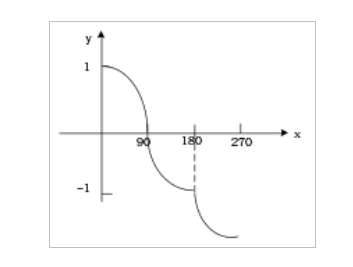

# insightface
The original code is here. [InsightFace](https://github.com/deepinsight/insightface)

mxnet, fast-insightface,face recognition, face detect
# insightface fast
I have optimized loss function, according to original loss. And the new one will fast convergence.
# new loss function

